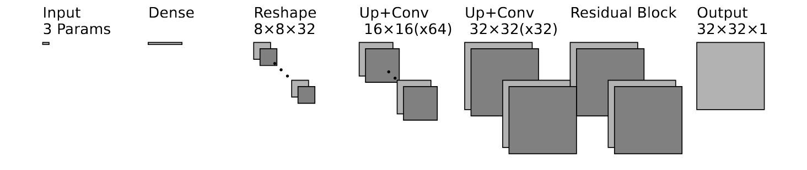

# Param2Weld

Param2Weld is a deep learning framework for predicting weld keyhole morphology from laser process parameters using convolutional decoder networks. It leverages simulated images to learn spatial mappings from parameters such as scan velocity, laser power, and spot size.

## Architecture

The core model is a convolutional decoder that maps three input parameters to a predicted 2D morphology image. The architecture includes dense layers, reshaping, upsampling, convolutional blocks and residual connections.



## Features

* Input: 3D vector (velocity, power, spot size)
* Output: 2D morphology image (e.g., 32×32 resolution)
* Loss function: Hybrid combination of MAE and SSIM
* Training method: k-Fold Cross-Validation with ensemble prediction
* Configurable architecture and hyperparameters via CLI and JSON overrides

## Installation

We recommend using a virtual environment:

```bash
python -m venv .venv
source .venv/bin/activate  # or .venv\Scripts\activate on Windows
```

Then install the required dependencies:

```bash
pip install -r requirements.txt
```

## Hyperparameter Optimization

To perform automatic hyperparameter tuning with Optuna using the provided simulation folders:

```bash
python -m param2weld.scripts.tune_optuna \
  --fixed_params experiments/optuna/configs/fixed_median_mae80_ssim20.json
```

Example output:

```text
[I 2025-07-11 14:12:03] Trial 0 finished with value: 0.0145 and parameters: {"dropout": 0.12, "dense_units": 1024, "f_block1": 64, "f_block2": 16, "l2_reg": 4.6e-06, "batch_size": 16}.
[I 2025-07-11 14:23:17] Trial 1 finished with value: 0.0151 and parameters: {"dropout": 0.0, "dense_units": 512, "f_block1": 32, "f_block2": 16, "l2_reg": 1e-05, "batch_size": 8}.
...
Best hyperparameters saved to: experiments/optuna/results/median/mae80_ssim20/best_hyperparams_2025-07-11_14-45-02.json
```

Configuration files are located in:

```bash
experiments/optuna/configs/
```

## Training

To initiate training with cross-validation:

```bash
python -m main train \
  --data_dir path/to/simulations \
  --model_dir path/to/save/models \
  --params_json custom_params.json
```

Each training fold saves:

* The trained model (`.keras`)
* Training history (`.npy`)
* Input scaler (`.pkl`)
* TensorBoard logs for monitoring

## Data Structure

Each simulation folder (e.g., `sim_0.58_534_96`) must contain a resolution-specific subfolder (e.g., `32/`) with grayscale PNG images representing the simulation output.

## Inference

To generate predictions after training:

```python
from param2weld.predict.predictor import generate_prediction_image
```

Load the trained ensemble and input scaler, then run:

```python
img = generate_prediction_image(velocity, power, spot_size, scaler, ensemble_models)
```

The output is a normalized 2D array representing the predicted morphology.

## License

This project is licensed under the MIT License. See the [LICENSE](LICENSE) file for details.
